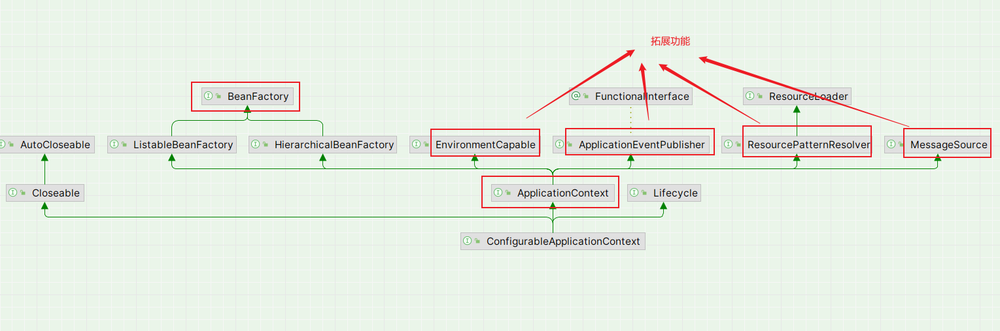
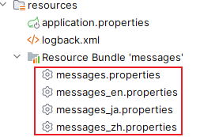

# 概述

视频地址: https://www.bilibili.com/video/BV1P44y1N7QG

内容大纲: 

1.   容器和Bean
2.   AOP
3.   Web MVC
4.   Spring Boot
5.   其他

---

# 一、容器和bean

## 1 容器接口

>   1.   BeanFactory的功能
>   2.   ApplicationContext功能拓展
>   3.   事件解耦


### 1.1 BeanFactory的功能

>   A01Application.class



#### 1.1.1 BeanFactory

-   是 ApplicationContext 的父接口
-   是Spring的核心容器
-   ApplicationContext在它的基础上组合了其他的功能

```java
ConfigurableApplicationContext context = SpringApplication.run(A01Application.class, args);
System.out.println(context);
```


#### 1.1.2 BeanFactory 的功能

-   表面上都是getBean的方法
-   实际上控制反转,基本的依赖注入,直至Bean的生命周期的各种功能,都由它提供 (拓展)

```java
// 使用反射把 DefaultSingletonBeanRegistry 的 private成员 singletonObjects 拿到并打印
Field singletonObjects = DefaultSingletonBeanRegistry.class.getDeclaredField("singletonObjects");
singletonObjects.setAccessible(true);

ConfigurableListableBeanFactory beanFactory = context.getBeanFactory();
// 反射 beanFactory 对象中用这个Field描述的成员的值
// beanFactory 中有 singletonObjects 成员
Map<String, Object> map = (Map<String, Object>) singletonObjects.get(beanFactory);
map.entrySet().stream().filter(e -> e.getKey().startsWith("component"))
  .forEach(e -> {
    System.out.println(e.getKey() + "=" + e.getValue());
  });

```

#### 1.1.3 ApplicationContext 比 BeanFactory 多的拓展功能

-   MessageSource: 国际化
-   ResourcePatternResolver: 资源
-   EnvironmentCapable: 环境变量
-   ApplicationEventPublisher: 事件发布事件发布用于解耦,比如用户注册,不好指定验证码发送方式,邮箱还是短信,通过事件发布


##### 1.1.3.1 国际化

配置




```java
System.out.println(context.getMessage("hi", null, Locale.CHINA));
System.out.println(context.getMessage("hi", null, Locale.ENGLISH));
System.out.println(context.getMessage("hi", null, Locale.JAPAN));
```


##### 1.1.3.2 资源

```java
//        Resource[] resources = context.getResources("classpath:application.properties");
Resource[] resources = context.getResources("classpath*:META-INF/spring.factories");  // classpath* 是在类路径下jar包中寻找
for (Resource resource : resources) {
  System.out.println(resource);
}
```


##### 1.1.3.3 环境变量

```java
String javaHome = context.getEnvironment().getProperty("java_home");// 不区分大小写
System.out.println("javaHome = " + javaHome);
String msgEncoding = context.getEnvironment().getProperty("spring.messages.encoding");// 不区分大小写
System.out.println("msgEncoding = " + msgEncoding);
```


##### 1.1.3.4 事件发布

定义事件

```java
/**
 * 事件
 * @author qlk
 */
public class UserRegisteredEvent extends ApplicationEvent {
    /**
     *
     * @param source 事件源
     */
    public UserRegisteredEvent(Object source) {
        super(source);
    }
}
```

事件监听

```java
@Component
public class Component1 {

    private static final Logger log = LoggerFactory.getLogger(Component1.class);

    @Autowired
    private ApplicationEventPublisher publisher;

    public void register() {
        log.debug("用户注册");
        publisher.publishEvent(new UserRegisteredEvent(this));
    }
}
```

触发

```java
context.getBean(Component1.class).register();
```

---


### 1.2 ApplicationContext功能拓展

>   TestBeanFactory.class

#### 1.2.1 DefaultListableBeanFactory

它只做`bean定义`的注册**,**功能较为简单

```java
// 常用的 BeanFactory , DefaultListableBeanFactory
DefaultListableBeanFactory beanFactory = new DefaultListableBeanFactory();
// bean定义
AbstractBeanDefinition beanDefinition =
  BeanDefinitionBuilder.genericBeanDefinition(Config.class)
  .setScope("singleton")
  .getBeanDefinition();
// bean注册
beanFactory.registerBeanDefinition("config", beanDefinition);

for (String name : beanFactory.getBeanDefinitionNames()) {
  System.out.println(name);
}
```


#### 1.2.2 给 BeanFactory 添加 后处理器

-   给 beanFactory添加解析注解的 后处理器(只是加入到了bean工厂) ,功能扩展
-   bean工厂后处理器 需要执行postProcessBeanFactory方法才能使用
-   beanFactory后处理器主要功能, 补充一些bean定义

通过:

```java
// 添加一系列后处理器,已经排序器等等
AnnotationConfigUtils.registerAnnotationConfigProcessors(beanFactory);

// 1.添加 BeanFactory后处理器
beanFactory.getBeansOfType(BeanFactoryPostProcessor.class).values().
  forEach(beanFactoryPostProcessor -> {
    // 真正执行解析注解的方法
    beanFactoryPostProcessor.postProcessBeanFactory(beanFactory);
  });

  
// 2.添加 Bean 后处理器
// 针对 bean 的生命周期的各个阶段提供扩展,(比如 依赖注入)
beanFactory.getBeansOfType(BeanPostProcessor.class).values()
                .forEach(beanPostProcessor -> {
                    System.out.println("beanPostProcessor = >>> " + beanPostProcessor);
                    beanFactory.addBeanPostProcessor(beanPostProcessor);
                });

```

```java
// 一系列的后置处理器
// 处理 @Config注解 , BeanFactory后置处理器
org.springframework.context.annotation.internalConfigurationAnnotationProcessor
// @Autowired , Bean后置处理器
org.springframework.context.annotation.internalAutowiredAnnotationProcessor
// @Resource, Bean后置处理器
org.springframework.context.annotation.internalCommonAnnotationProcessor
org.springframework.context.event.internalEventListenerProcessor
org.springframework.context.event.internalEventListenerFactory
```


#### 1.2.3 bean后处理器的执行顺序

从@Autowired和@Resource同时使用,且指定不同的bean, 最后生效的是@Autowired

原因在于:

`beanFactory::addBeanPostProcessor`

添加bean后处理的顺序决定其优先级**,**先加入的优先级高,

默认情况下,

*AutowiredAnnotationBeanPostProcessor*会先注册


修改比较器顺序,会发现 @Resource生效

```java
// 修改 bean后处理器的执行顺序
        beanFactory.getBeansOfType(BeanPostProcessor.class).values().stream()
                // 比较器排序
                /*
                比较器是在
                AnnotationConfigUtils.registerAnnotationConfigProcessors(beanFactory);
                时添加的
                AnnotationAwareOrderComparator.INSTANCE

                比较是通过 bean后处理器的 order 属性
                    例如:
                   1.
                        public CommonAnnotationBeanPostProcessor() {
                            setOrder(Ordered.LOWEST_PRECEDENCE - 3);
                            ...
                        }
                   2.
                        AutowiredAnnotationBeanPostProcessor
                         ...
                         private int order = Ordered.LOWEST_PRECEDENCE - 2;
                 */
                .sorted(beanFactory.getDependencyComparator())
                .forEach(beanPostProcessor -> {
                    System.out.println("beanPostProcessor = >>> " + beanPostProcessor);
                    beanFactory.addBeanPostProcessor(beanPostProcessor);
                });
```


---

### 1.3  ApplicationContext 的接口实现


